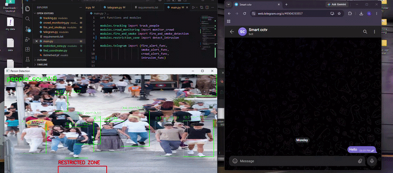
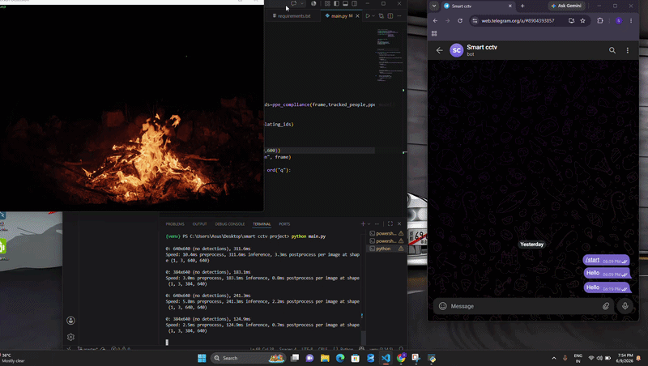

# Smart CCTV Analytics System

A real-time Computer Vision based CCTV surveillance system that monitors video streams and automatically detects safety and security events.

The system can:

- Track people in real time
- Count the number of people present
- Generate crowd density alerts
- Detect fire incidents
- Detect intrusion inside restricted zones
- Send instant Telegram notifications

---

# Features

## Person Tracking
- Real-time person detection and tracking
- Assigns IDs to tracked individuals
- Maintains tracking across video frames

## People Counting
- Counts the number of detected people
- Displays live count on screen
- Useful for occupancy monitoring

## Crowd Density Alert
- Monitors crowd size continuously
- Triggers alert when crowd threshold is exceeded
- Suitable for public places and industrial environments

## Fire Detection
- Detects fire from CCTV footage
- Generates warning alerts
- Helps improve emergency response time

## Restricted Zone Intrusion Detection
- Monitors predefined restricted areas
- Detects unauthorized entry
- Generates intrusion alerts

## Telegram Notifications
- Sends real-time alerts directly to Telegram
- Fire Alert
- Crowd Alert
- Intrusion Alert

---

# Demo

## Crowd Alert



## Fire Detection



## Intrusion Detection


---

# Screenshots

## Crowd Alert


## Fire Detection


## Intrusion Detection


---

# Project Architecture

```text
Video Stream (main loop)
       │
       ▼
Object Detection
       │
       ▼
Person Tracking
       │
       ▼
People Counting
       │
       ├── Crowd Monitoring
       ├── Fire Detection
       └── Intrusion Detection
       │
       ▼
Telegram Alert System
```
---

# Technologies Used

- Python
- OpenCV
- YOLO
- NumPy
- Telegram Bot API

----------------------------------


## Installation

### Clone Repository
```bash
git clone https://github.com/Samikhxnn/smart-cctv-analytics.git
cd smart-cctv-analytics
```
---

# Folder Structure 
```text

smart-cctv-analytics/
│
├── main.py
├── requirements.txt
├── README.md
│
├── modules/
│   ├── fire_and_detection.py
│   ├── crowd_monitoring.py
│   ├── intrusion_detection.py
│   ├── tracking.py
│   └── telegram.py
│
├── models/
│   
│
├── screenshots/
│   ├── crowd_alert.png
│   ├── fire_detection.png
│   └── intrusion_detection.png
│
├── demo/
│   ├── crowd.gif
│   ├── fire.gif
│   └── intrusion.gif 
```

---

# Alert Types

| Alert Type | Description |
|------------|-------------|
| Crowd Alert | Triggered when people count exceeds threshold(9 people) |
| Fire and smoke Alert | Triggered when fire/smoke is detected |
| Intrusion Alert | Triggered when a person enters restricted area |

---

# Applications

- Smart City Surveillance
- Factory Monitoring
- Construction Site Safety
- Office Security
- Warehouse Monitoring
- Restricted Area Protection

---

# Future Improvements

- PPE Detection
- Vehicle Detection
- Multi-Camera Monitoring
- Dashboard Analytics
- Email Alerts

---

# Author

Sami Khan


